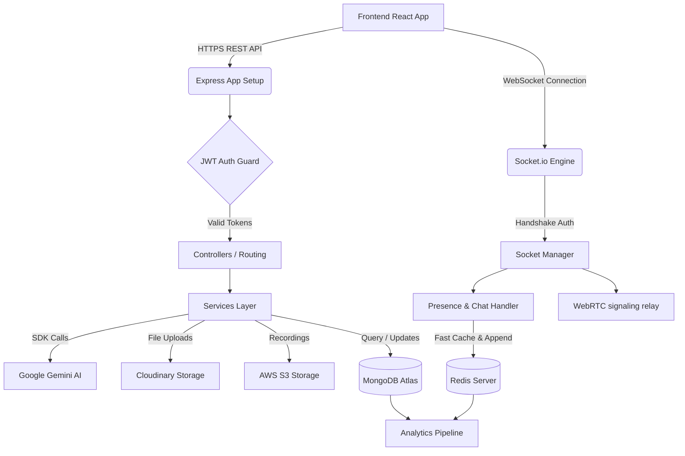

<div align="center">
  <div style="padding: 1.5rem; border-radius: 1rem; background: linear-gradient(to right, #3b82f6, #8b5cf6); display: inline-block; margin-bottom: 1rem;">
    <h1 style="color: white; margin: 0; font-size: 2.5rem;">🧠 IntelliMeet</h1>
  </div>
  
  <p><strong>The Next-Generation AI-Powered Enterprise Meeting & Collaboration Platform</strong></p>
  
  <p>
    <a href="#features">Features</a> •
    <a href="#tech-stack">Tech Stack</a> •
    <a href="#project-structure">Project Structure</a> •
    <a href="#getting-started">Getting Started</a>
  </p>
</div>

---

IntelliMeet is a secure, full-stack, enterprise-grade real-time collaboration workspace. It features advanced video conferencing via WebRTC, rich instant messaging, Kanban-based task allocation, workspace organization, push notifications, and powerful AI integrations powered by **Google Gemini** (providing live summaries, agenda predictions, productivity metrics, and multimodal audio transcribing).

## ✨ Key Features

### 🎥 Video & Audio Collaboration
*   **Real-time WebRTC**: Low latency peer-to-peer and relayed video/audio routing.
*   **Live Transcript & Recording**: Cloud-recorded meetings with live captions.
*   **Reactions & Screen Sharing**: Express yourself and present with high frame-rate screen sharing.

### 🤖 AI-Powered by Google Gemini
*   **Auto-Summarization**: Instantly generates comprehensive meeting summaries the moment a meeting ends.
*   **Action Item Extraction**: AI automatically creates Kanban tasks from meeting transcripts.
*   **Productivity Analytics**: Engagement metrics and meeting health scores calculated by Gemini.

### 📋 Team Workspace & Kanban
*   **Task Management**: Interactive drag-and-drop Kanban boards.
*   **Real-time Messaging**: Instant chat via Socket.io with typing indicators and online presence.
*   **Team Organization**: Workspaces with invite links and role-based access.

### 🔒 Enterprise Security
*   **JWT & Refresh Token Rotation**: Secure `httpOnly` cookie-based authentication.
*   **Data Hardening**: XSS protection, NoSQL injection prevention, and strict CORS.
*   **Rate Limiting & Redis**: Fast session handling and abuse protection.

---

## 🛠️ Tech Stack

### Frontend (`intellmeet-frontend`)
*   **Core**: React 18 (Vite), TypeScript
*   **Styling**: Tailwind CSS, Radix UI, Lucide Icons, Framer Motion
*   **State & Fetching**: Zustand, React Query (TanStack), Axios
*   **Real-time**: Socket.io-client, WebRTC APIs

### Backend (`intellmeet-backend`)
*   **Core**: Node.js (v20+), Express.js
*   **Database & Cache**: MongoDB Atlas (Mongoose), Redis (ioredis)
*   **Real-time**: Socket.io v4
*   **AI & Cloud**: Google Gemini SDK, AWS S3 (Recordings), Cloudinary (Avatars/Attachments)
*   **Security**: bcryptjs, helmet, xss, express-mongo-sanitize

---

## 📁 Project Structure

This repository is structured as a monorepo containing both the frontend and backend applications as sibling directories.

```text
IntelliMeet/
├── intellmeet-backend/       # Node.js/Express API, WebSocket server, and AI logic
│   ├── src/                  # Controllers, Models, Routes, Services, Sockets
│   ├── tests/                # Jest integration tests
│   ├── .env.example          # Backend environment variables template
│   └── package.json
│
├── intellmeet-frontend/      # React/Vite web application
│   ├── src/                  # Components, Hooks, Features, Stores, Layouts
│   ├── .env.example          # Frontend environment variables template
│   └── package.json
│
└── .gitignore                # Root gitignore
```

---

## 🚀 Getting Started

### Prerequisites
*   [Node.js](https://nodejs.org) (v20 or higher)
*   MongoDB instance (local or Atlas)
*   Redis server (local or cloud)

### 1. Clone the Repository
```bash
git clone https://github.com/yasar-pathan/IntelliMeet.git
cd IntelliMeet
```

### 2. Setup the Backend
Open a new terminal window:
```bash
cd intellmeet-backend
npm install
cp .env.example .env   # Fill in your MongoDB, Redis, and Gemini API keys in .env
npm run dev            # Starts the backend server on http://localhost:5000
```

### 3. Setup the Frontend
Open a second terminal window:
```bash
cd intellmeet-frontend
npm install
cp .env.example .env   # Configure the API URL (VITE_API_URL=http://localhost:5000/api/v1)
npm run dev            # Starts the Vite dev server on http://localhost:5173
```

---

## 🏗️ Architecture Flow



---

<div align="center">
  <p>Built with ❤️ for modern engineering teams.</p>
</div>
