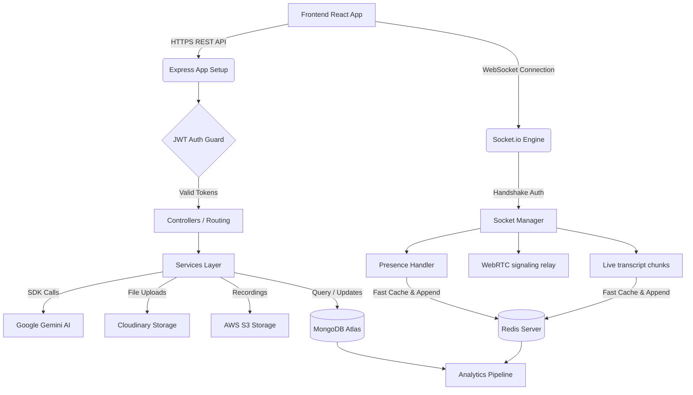

# 🧠 IntellMeet — AI-Powered Enterprise Meeting & Collaboration Platform Backend
<!-- Triggering CI/CD Workflow Test 4 -->

IntellMeet is a secure, enterprise-grade, real-time collaboration server. It features an advanced WebRTC signaling server, rich instant messaging, Kanban-based task allocation, workspace organization, push notifications, and AI analysis powered by Google Gemini (providing summaries, agenda predictions, productivity metrics, and multimodal audio transcribing).

---

## 🏗️ Architecture Design & Tech Stack



- **Runtime**: Node.js v20+ with Express.js
- **Database**: MongoDB Atlas using Mongoose ODM
- **In-Memory Caching & Session Blacklist**: Redis (via `ioredis`)
- **Real-Time Layer**: Socket.io v4 with WebRTC signaling
- **AI Core**: Google Gemini Generative AI SDK (`gemini-1.5-pro` & `gemini-1.5-flash`)
- **Storage**: AWS S3 Bucket (meeting recordings) + Cloudinary CDN (avatars & file attachments)
- **Error Tracking**: Winston Logger + Sentry Monitoring

---

## 🛠️ Setup Instructions

### Prerequisites
Make sure you have installed:
- [Node.js](https://nodejs.org) (v20 or higher)
- [Docker & Docker Compose](https://www.docker.com/) (optional, for localized containerized setups)

### Step 1: Install Dependencies
```bash
npm install
```

### Step 2: Configure Environment Variables
Copy `.env.example` to `.env` and fill in your credential API keys:
```bash
cp .env.example .env
```

### Step 3: Run the Application

#### Option A: Local Development
Ensure your local MongoDB and Redis instances are running, then run:
```bash
npm run dev
```

#### Option B: Containerized Development (Docker Compose)
Build and run the entire stack (Node application, MongoDB instance, Redis cache) inside Docker containers:
```bash
docker-compose up --build -d
```

---

## 🧪 Testing

The codebase features comprehensive integration tests covering authentication gates, JWT rotation, access blacklist, meeting room lifecycle, and WebRTC TURN credential issuance.

To run the test suite, ensure MongoDB and Redis test databases are active, then run:
```bash
npm test
```

---

## 📝 API Reference Outline

All routing is prefixed by `/api/v1`.

### 🔐 Authentication System (`/auth`)
- `POST /auth/register` — Register a new account (triggers email verification link).
- `POST /auth/verify-email?token=<token>` — Verify email address using link token.
- `POST /auth/login` — Log in and return tokens (updates online presence).
- `POST /auth/refresh-token` — Retrieve a rotated access token pair (using httpOnly cookie).
- `POST /auth/logout` — Logout user (revokes refresh token and blacklists access token in Redis).
- `POST /auth/forgot-password` — Request password reset email.
- `POST /auth/reset-password?token=<token>` — Update password (invalidates all other sessions).
- `GET /auth/me` — Retrieve active user session profile details.

### 👥 User Profiles (`/users`)
- `GET /users/me` — Detailed profile (cached).
- `PATCH /users/me` — Edit user profile information.
- `PATCH /users/me/avatar` — Upload avatar file directly to Cloudinary.
- `PATCH /users/me/preferences` — Save notification preferences, theme, and language.
- `DELETE /users/me` — Soft deactivate user account.
- `GET /users/search?q=<query>` — Teammates autocomplete search.

### 📹 Meeting Rooms (`/meetings`)
- `POST /meetings` — Create/schedule a meeting (hashes passcode).
- `GET /meetings` — Paginated meetings history list (filters: status, date range, team).
- `GET /meetings/:meetingId` — Single meeting detail.
- `POST /meetings/:meetingId/join` — Join room (returns RTC TURN credentials).
- `POST /meetings/:meetingId/leave` — Exit room (ends meeting if last, flushes Redis transcript, and runs AI summaries).
- `POST /meetings/:meetingId/recording/start` — Start recording.
- `POST /meetings/:meetingId/recording/stop` — Save recording URL reference.

### 🤖 Gemini AI Service (`/ai`)
- `POST /ai/summarize/:meetingId` — Request immediate summary & action task creations.
- `POST /ai/generate-agenda` — Request agenda suggestions.
- `GET /ai/productivity/:meetingId` — Request meeting engagement metrics score.

### 📋 Task Manager (`/tasks`)
- `POST /tasks` — Create task (alerts assignee).
- `GET /tasks` — List tasks.
- `PATCH /tasks/:taskId` — Update properties/statuses.
- `PATCH /tasks/reorder` — Bulk reorder Kanban positions.

### 👥 Workspaces (`/teams`)
- `POST /teams` — Create team.
- `POST /teams/join/:inviteCode` — Join team using invite code URL.

---

## 🔒 Security Hardening Implementations

1. **OWASP Top 10 Protections**: Implemented security headers via `helmet()`.
2. **Strict CORS Policy**: Whitelists only trusted client domains.
3. **NoSQL Injection**: Cleans parameters using `express-mongo-sanitize`.
4. **XSS Protection**: Sanitizes inputs recursively using `xss`.
5. **Token Security**: Tokens are short-lived. Refresh tokens are restricted to `httpOnly` secure, `sameSite: strict` cookie domains.
6. **Rate Limiting**: Set discrete window limits on public, auth, and AI endpoints via Redis stores.
7. **Password Hashing**: Cryptographically secure hashing with 12 salt rounds via `bcryptjs`.
